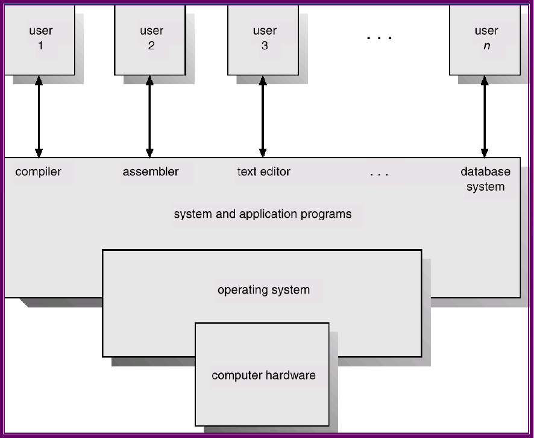
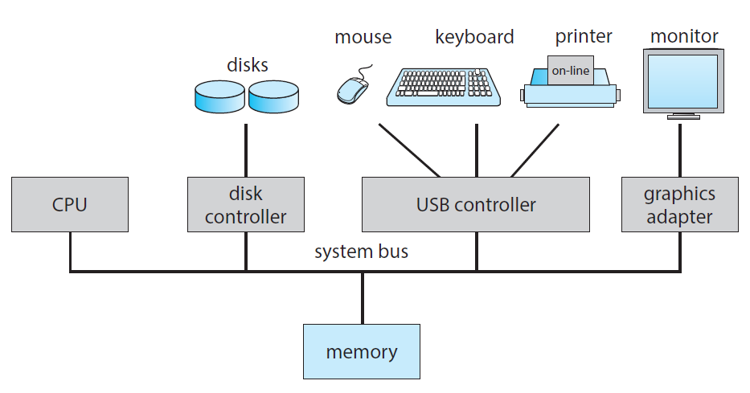
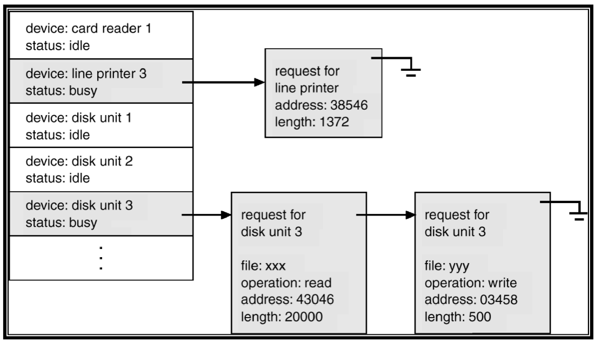
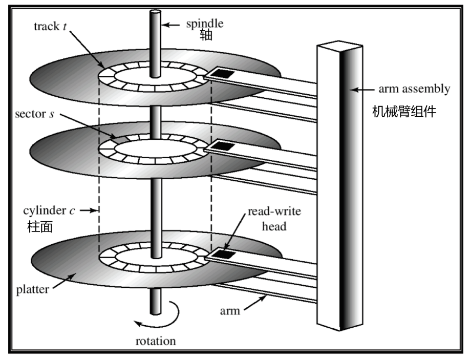
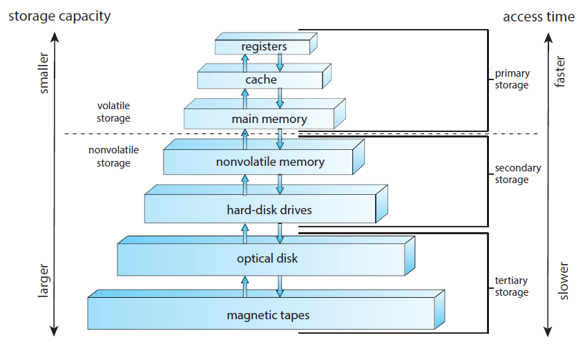
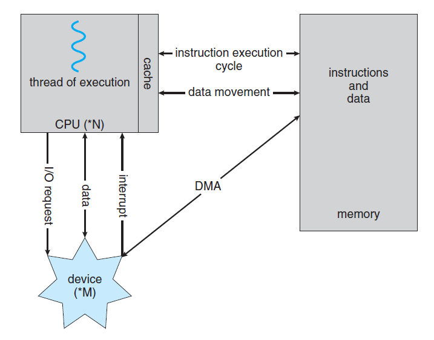
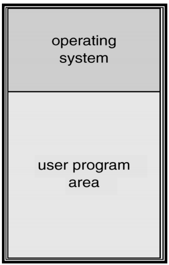
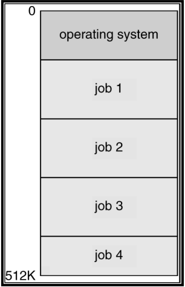
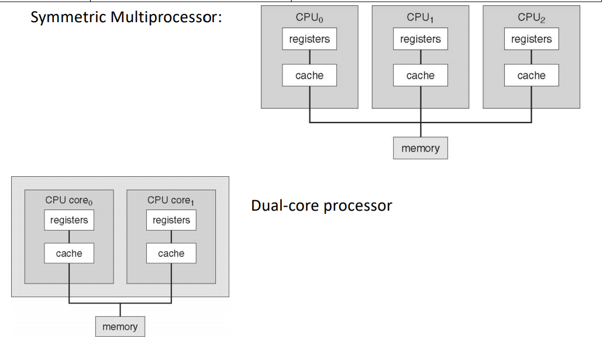
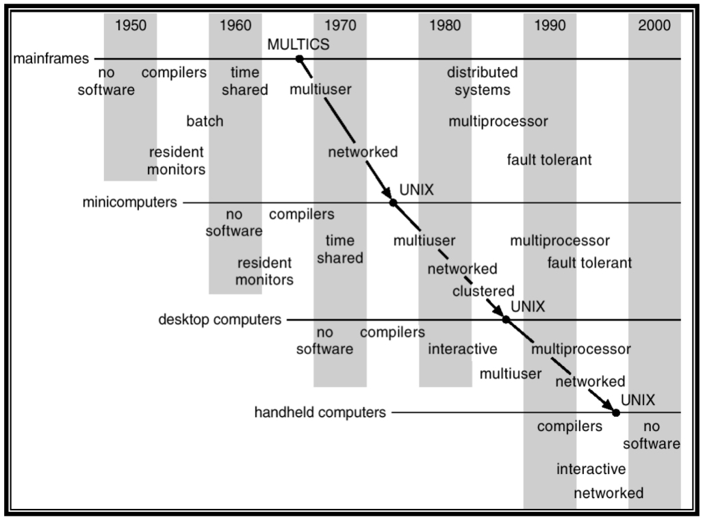

<a href="https://mengduanxian.github.io/">梦断弦の小窝</a>

# Operating System Introduction

## What is an Operating System?

* Operating System is a ***software*** that <u>controls the execution of programs</u> and that <u>provides services</u> such as *resource allocation*, *scheduling*, *input/output control*, and *data management*. 
* The OS acts as an intermediary between a user of the computer and the computer hardware.
* OS goals: 
  * Execute user programs and make solving user problems easier.
  * Make the computer hardware in an efficient manner. (efficient manner - time and space efficiency, 大O表示的那个)

## Computer System Components

1. **Hardware** - provides basic computing resources(CPU, memory, I/O devices).
2. **Operating System** - controls and coordinates the use of the hardware among the various users. 
3. **Application programs** - define the ways in which the system resources are used to solve the computing problems of the users (compiler, database systems, video games, business programs).
4. **Users** - people, machines, other computers. 

## Abstract view of system components




## Definitions

You can think of an Operating System as a:

* **resource allocator** - manages and allocates resources. 
* **control program** - controls the execution of user programs and operations of I/O devices. 
* **Kernel** - the one program running at all times (all else being application programs).

## Computer Startup

A *bootstrap program(引导程序)* is loaded at power-up or reboot.

* Typically stored in ROM or EPROM (Electrically Programmable Read-Only-Memory可擦可编程只读存储器), generally known as firmware(固件). 
* Initializes all aspects of the system. 
* Loads operating system kernel and starts execution. 

## Computer System Organization

Computer-system operation 计算机系统操作

* One or more CPUs, device controllers connect through a common bus providing access to shared memory. 

  (一个或多个CPU、设备控制器通过一条公共总线连接，以提供对共享内存的访问。)




## Interrupts

* We want the I/O devices and the CPU to be able to execute concurrently.
  * The CPU shouldn't have to wait for the much slower I/O device. 
* The I/O device signals an *interrupt* when it is ready. (I / O设备准备就绪时会发出“中断”信号。)
* When an interrupt occurs, the operating system must:
  * Transfer control to the appropriate interrupt handler.
  * Since there is more than one device, we use an interrupt vector (中断向量).

## Interrupts: Controllers vs. Handlers

* A device controller (hardware / firmware) is responsible for moving data between the <u>media</u> and its <u>local registers</u>. 
* An interrupt handler (software) is responsible for moving data between the <u>controller registers</u> and <u>memory</u> (so it can be accessed by the user program).
  * Since these are multiple types of interrupts, there is a handler for each type. 

## Processing an Interrupt

1. User program has control
2. I/O interrupt occurs
   * eg. disk controller signals data read operation completed. (磁盘控制器发出数据读取操作已完成的信号。)
3. User program no longer processed by the CPU
   * current position saved (Program Counter) and interrupt disabled. 
4. Control transferred to interrupt handler (控制权转移到中断处理程序)
   * CPU registers representing current state are saved. (保存代表当前状态的CPU寄存器。)
5. Data transferred from controller to memory or from memory to controller depending on whether input or output operation. 
6. CPU registers restored. (CPU寄存器恢复)
7. Control returned to user program. 
   * interrupts re-enabled & restore program counter. (中断重新启用并恢复程序计数器)

## I/O Structure

* The CPU and device controllers operate in parallel.

* Two types of I/O operations:
  * **synchronous(同步)**: user program waits until I/O operation completes. 
  * **asynchronous(异步)**: user program allowed to continue while I/O operation is in progress. 
  
  ```
  如何区分是同步IO还是异步IO？
  	- 当请求被阻塞，就是同步IO，否则就是异步IO
  ```
  
  ```
  同步IO的特点：
  	- 同步IO指的是用户进程触发I/O操作并等待或者轮询的去查看I/O操作是否就绪。
  	- 同步IO的执行者是IO操作的发起者。
  	- 同步IO需要发起者进行内核态到用户态的数据拷贝过程，所以这里必须有个阻塞。
  ```
  
  ```
  异步IO的特点：
  	- 异步IO是指用户进程触发I/O操作以后就立即返回，继续开始做自己的事情，而当I/O操作已经完成的时候会得到I/O完成的通知。
  	- 异步IO的执行者是内核线程，内核线程将数据从内核态拷贝到用户态，所以这里没有阻塞。
  ```
  
  
  
* Asynchronicity is essential for multiprogramming (=multi-tasking)

* This allows program B to have control of the CPU while program A is waiting for I/O.


## I/O Structure - Device Status Table

* A ***device status table*** keeps track of <u>which devices are busy</u>, <u>what they are doing for which program</u>, and <u>which programs are waiting for access to devices</u>. 

  

  (idle 闲置的)

## I/O Structure - Direct Memory Access (DMA)

* Used for high-speed I/O devices able to transmit information at close to memory speeds. 
* Device controller transfers blocks of data from buffer storage directly to main memory without CPU intervention. 
  * **Buffer**（缓冲区）是系统两端处理**速度平衡**（从长时间尺度上看）时使用的。它的引入是为了减小短期内突发I/O的影响，起到**流量整形**的作用。比如生产者——消费者问题，他们产生和消耗资源的速度大体接近，加一个buffer可以抵消掉资源刚产生/消耗时的突然变化。
  * **Cache**（缓存）则是系统两端处理**速度不匹配**时的一种**折衷策略**。因为CPU和memory之间的速度差异越来越大，所以人们充分利用数据的局部性（locality）特征，通过使用存储系统分级（memory hierarchy）的策略来减小这种差异带来的影响。
  * 假定以后存储器访问变得跟CPU做计算一样快，cache就可以消失，但是buffer依然存在。比如从网络上下载东西，瞬时速率可能会有较大变化，但从长期来看却是稳定的，这样就能通过引入一个buffer使得OS接收数据的速率更稳定，进一步减少对磁盘的伤害。
* Only one interrupt is generated per block, rather than one per byte. 

## Storage Structure

* Typical (von Neumann) instruction-execution cycle
  * instruction loaded from main memory into CPU
    * Main memory - only large storage media that the CPU can access directly. 
  * instruction decoded
    * may cause other operands to be retrieved(恢复) from memory.
  * instruction executed, repeat
* Secondary storage - extension of main memory that provides large nonvolatile(非易失性) storage capacity. 

#### Magnetic Disks 磁盘

* Magnetic disks - rigid metal or glass platters covered with magnetic recording material. (覆盖有磁记录材料的刚性金属或玻璃盘片。)

  * Disk surface is logically divided into tracks, which are subdivided into sectors. (磁盘表面在逻辑上分为磁道，这些磁道又细分为扇区。)
  * The *disk controller* determines the logical interaction between the device and the computer. 

* Magnetic Disk Architecture

  

#### Solid-State Drives 固态硬盘

* Solid-State Drives use **NAND Flash** technology (50 megabytes / s)
* Bits stored as charges in cells made of transistors(晶体管). (位作为电荷存储在晶体管构成的单位中)
* SLC, MLC, and TLC drives differ in how many bits are stored per cell. 
  * SLC = Single-Level Cell ，即1bit/cell，速度快寿命长，价格超贵（约MLC 3倍以上的价格），约10万次擦写寿
  * MLC = Multi-Level Cell，即2bit/cell，速度一般寿命一般，价格一般，约1000--3000次擦写寿命
  * TLC = Trinary-Level Cell，即3bit/cell，也有Flash厂家叫8LC，速度慢寿命短，价格便宜，约1000次擦写寿命。
* Organization: 8 channels, 4 dies per channel. 

#### Caching 缓存

* Caching is the use of a smaller, but faster, memory system to speed up a bigger, but slower,memory system.
  * The cache holds the data most recently accessed by the CPU
  * effective because most programs access the same data or instruction repeatedly. 
* *Cache management* is an important design problem. A well chosen cache size and replacement policy can result in 80+% of all accesses being in the cache. 
* Problem:
  * Different processes must see the same value for an item. 

## Storage Hierarchy 



<a href="[https://mengduanxian.github.io/OperatingSystem/%E7%A1%AC%E4%BB%B6-%E5%AD%98%E5%82%A8%E4%BB%8B%E8%B4%A8.html](https://mengduanxian.github.io/OperatingSystem/硬件-存储介质.html)"> 各种存储介质简介</a>

## How a Modern Computer Works



​				CPU(*N) = multiple CPUs

​				DMA = Direct Memory Access

## Mainframe Systems 大型计算机系统

(Super Computers)

* Mainframes are large, powerful computers designed to handle large numbers of users and jobs.
* The first operating systems appeared in mainframes
  * Similar jobs batched together to reduce set-up time. 
  * One job executed at a time - no multi-tasking.
* The OS (called a monitor) transfers control to the job, when the job is done control is return to the OS.

 

The next step up is the Multiprogrammed Batch System (多程序批处理系统)

* Several jobs are kept in main memory at the same time, and the CPU is multiplexed among them. (几个作业同时保存在主存储器中，并且CPU在其中复用)
* Each job has its own memory space.



Some of the OS features needed for Multiprogramming:

* I/O routine supplied by the system (系统提供的I/O例行程序)
* Memory management (内存管理)
  * The system must allocate memory to many jobs. 
* CPU scheduling 
  * The system must choose among several jobs ready to run. (系统必须在准备运行的几个作业中进行选择。)
* Allocation of devices (storage devices, etc.) (设备分配)

## Desktop Systems

* *Personal computers* - computer system dedicated(专用) to a single user. 
* I/O devices - keyboards, mice, monitors, printers.
* User convenience and responsiveness. (用户便利性和响应能力。)
* Can adopt technology developed for larger operating systems. (可以采用为大型操作系统开发的技术。)
  * Individuals have full use of computer and do not need advanced CPU utilization or protection features. (个人可以充分使用计算机，不需要高级CPU利用率或保护功能。)
* May run several different types of operating systems (Windows, Mac OS/X, UNIX, Linux)

## Multiprocessor Systems 多处理器系统

* Multiprocessor systems are systems with more than one CPU in close communication. (多处理器系统是具有多个CPU紧密通信的系统。)
  * e.g. multi-core CPUs
* This is a tightly coupled system (这是一个紧密耦合的系统)
  * processors share memory and a clock. 
  * communication occurs via shared memory.
* Advantages of parallel system(并行系统): 
  * Increased throughput 
  * Economical
  * Increased reliability

#### Types of Multiprocessor Systems

* Symmetric multiprocessing (SMP) 
  * Each processor runs an identical copy of the operating system. 
  * Many processes can run at once without performance deterioration(降低性能）. 
  * Most modern Oses support SMP. 
* Asymmetric multiprocessing
  * Each processor is assigned a specific task. 
  * Master processor schedules and allocates work to slave processors. 

#### Symmetric & Multi-core Processors




## Distributed Systems 分布式系统

* Another idea is to distribute the computation among several physical processors. 
* This is a loosely coupled system
  * each processor has its own local memory (RAM).
  * processes communicate with one another via networks (eg. LANs or WANs)

## Real-Time Systems 实时系统

* A real-time system is one where there are well-defined fixed-time constraints. (实时系统是存在明确定义的固定时间约束的系统。)
  * i.e. things need to happen in a reasonable amount of time and in the correct order. 
* Some examples: 
  * controlling robots for manufacturing.
  * controlling medical devices. 

## Handheld Systems 手持系统

Some examples:

* Personal Digital Assistants (PDAs) 个人数字助理
* Smartphones

Some of the issues when designing handheld systems: 

* limited memory
* slow processors
* small display screens

## OS Feature Migration 操作系统功能迁移

Operating system features tend to migrate over time from older systems to newer systems. 




